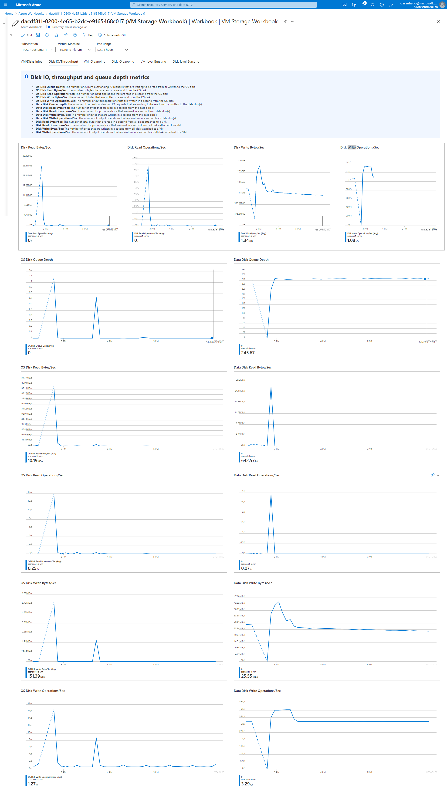
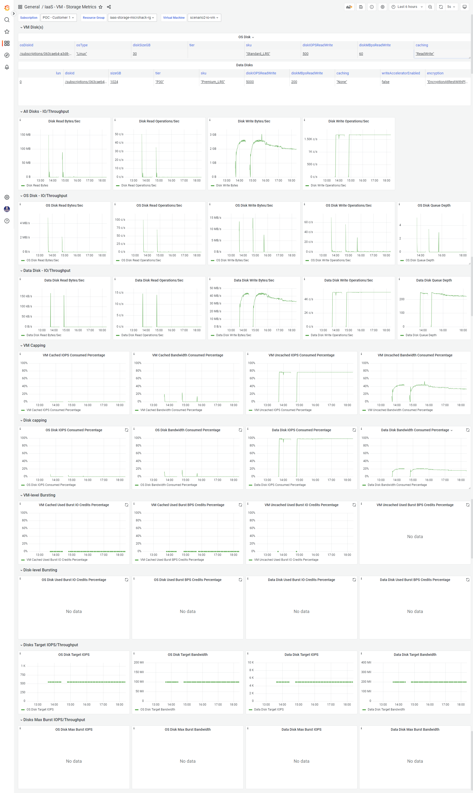

# Azure - IaaS Storage Monitoring

When dealing with Azure IaaS storage, it is important to know if we are IO/Throughput capped by the VM or by the disk(s), if we are bursted...

Azure provides [plenty of metrics](https://learn.microsoft.com/en-us/azure/virtual-machines/disks-metrics) to monitor machine storage. Intent of this repo is to share dashboards that can be useful 😀

## Azure Workbook

* [Link to Azure Workbook JSON](templates/azure-workbook.json)

**Preview**:

## Grafana Dashboard

* [Link to Grafana Dashboard JSON file](templates/grafana-dashboard.json)

**Preview**:

